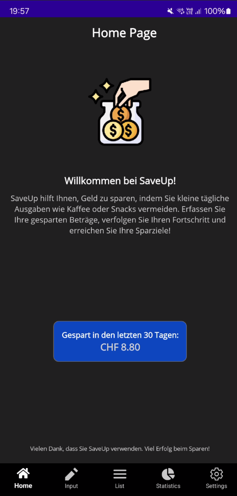
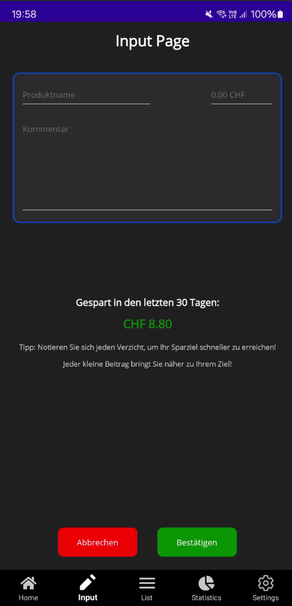
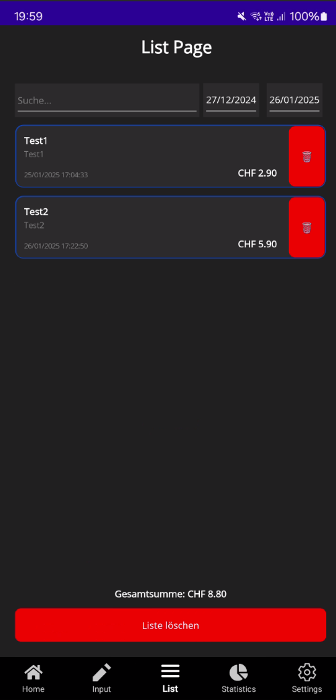
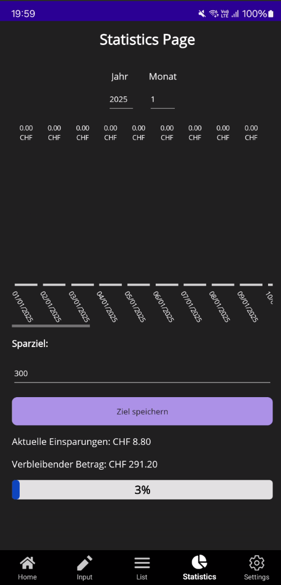
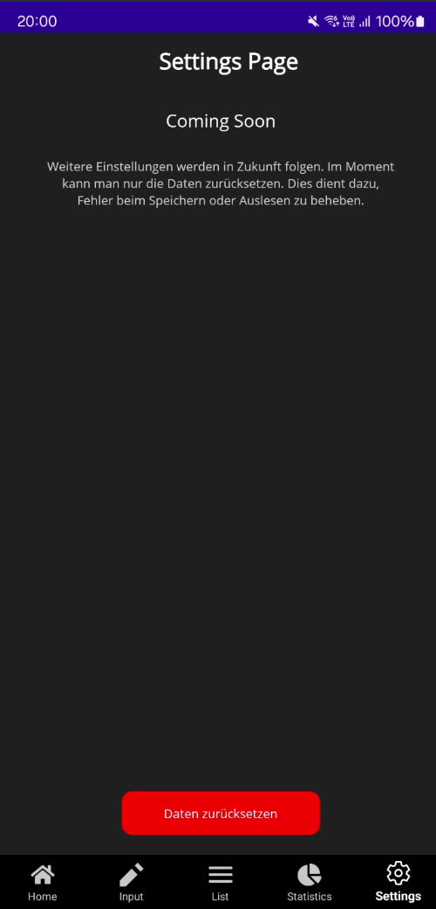

# SaveUp App

SaveUp ist eine .NET MAUI Anwendung, die Ihnen hilft, kleine Einsparungen im Alltag festzuhalten, um größere Ziele wie Reisen oder andere Investitionen zu erreichen. Mit SaveUp können Sie Ihre gesparten Ausgaben verfolgen, Ihre Fortschritte visualisieren und Ihre Ziele schneller erreichen.

---

## 📋 **Features**
### Pflichtanforderungen
1. **Eingabe von Verzichtsprodukten:**
   - Erfassen Sie Produkte mit einer Kurzbeschreibung und einem Preis.
   - Speichern Sie das Datum und die Uhrzeit der Erfassung.

2. **Gesamtübersicht:**
   - Zeigt alle gespeicherten Produkte in einer Liste an.
   - Berechnet die Gesamteinsparung basierend auf allen gespeicherten Produkten.

3. **Statistiken:**
   - Grafische Darstellung der gesparten Beträge im Zeitverlauf (Balkendiagramm).
   - Filterung nach Jahr und Monat.

4. **Benutzerfreundlichkeit:**
   - Intuitive Navigation zwischen Seiten: Home, Input, List, Statistics, Settings.
   - Einfaches und modernes Design mit abgerundeten Elementen.

5. **Persistenz:**
   - Speichern und Laden der Daten in einer lokalen JSON-Datei.

6. **Verwendung von MVVM:**
   - Klare Trennung von Logik und Benutzeroberfläche durch das MVVM-Entwurfsmuster.

7. **Dokumentation:**
   - Alle Code-Teile sind sauber dokumentiert und kommentiert.

### Optionale Features
1. **Einträge löschen:**
   - Löschen von Einträgen einzeln oder die gesamte Liste auf einmal.

2. **Grafische Darstellung:**
   - Visualisierung der Daten mit dynamisch skalierbarem Diagramm.
   - Fortschrittsbalken zeigt den aktuellen Sparfortschritt im Verhältnis zum Ziel.

---

## 🛠 **Technologien**
- **Framework:** .NET MAUI
- **Programmiersprache:** C#
- **Persistenz:** JSON-Datei
- **Architektur:** MVVM (Model-View-ViewModel)

---

## ⚙️ **Installation**
1. **Systemanforderungen:**
   - .NET SDK 9.0 oder höher
   - Visual Studio 2022 mit MAUI-Unterstützung
   - Android-Emulator oder ein physisches Gerät (bei Bedarf)

2. **Clone das Repository:**
   ```bash
   git clone https://github.com/Yannnnck/SaveUp.git
   cd SaveUp

1. **Projekt ausführen:**
   - Öffnen Sie die Projektmappe SaveUp.sln in Visual Studio.
   - Wählen Sie die gewünschte Plattform (Android, iOS, Windows).
   - Führen Sie das Projekt aus (F5).

## 🖼 Pages
1. **Home Page**
   - Übersicht über die App und Anzeige der Einsparungen der letzten 30 Tage.
     
2. **Input Page**
   - Erfassen von Produkten mit Name, Preis und Kommentar.
     
3. **List Page**
   - Detaillierte Liste aller gespeicherten Produkte mit Such- und Löschfunktionen.
     
4. **Statistics Page**
   - Grafische Darstellung der Einsparungen im Zeitverlauf.
     
5. **Settings Page**
   - Optionen zum Zurücksetzen der Daten.
     

## 📂 Projektstruktur
SaveUp
├── Abhängigkeiten/            # Externe Abhängigkeiten (keine Änderungen erforderlich)
├── Properties/                # Projekt- und Assembly-Infos (Standard)
├── Converters/                # Enthält Datenkonverter wie PercentageToWidthConverter
├──  Documentation/
│   ├── SaveUp.docx            # Dokumentation
│   ├── Modul322.pptx          # Präsentation
│   └── Modul322.xlsx          # Gannt
├── Models/                    # Datenmodelle wie Product und ChartData
├── Platforms/                 # Plattform-spezifische Implementierungen (Android, iOS, Windows)
│   ├── Android/
│   ├── iOS/
│   └── Windows/
├── Resources/                 # App-Icons, Styles und andere Ressourcen
├── Services/                  # Service-Klassen wie SharedData und FilePathProvider
├── ViewModels/                # ViewModel-Klassen für jede Seite
├── Views/                     # XAML-Ansichten für die Seiten
│   ├── HomePage.xaml
│   ├── InputPage.xaml
│   ├── ListPage.xaml
│   ├── SettingsPage.xaml
│   └── StatisticsPage.xaml
├── App.xaml                   # App-Ressourcen und Styles
└── MauiProgram.cs             # Einstiegspunkt für die .NET MAUI App


## 🚀 Features in Planung
   - Mehrsprachigkeit (Deutsch/Englisch).
   - Anbindung an eine Backend-Datenbank mit REST-Schnittstelle.
   - Barcode-Scanner zur schnelleren Produkterfassung.

## 🏆 Lessons Learned
1. **Die Implementierung des MVVM-Musters erleichtert die Wartbarkeit der Anwendung.**
2. **Die Nutzung von .NET MAUI ermöglicht eine plattformübergreifende Entwicklung.**
3. **Eine klare Dokumentation und Codekommentierung spart Zeit und Aufwand in der Nachbearbeitung.**
4. **Das Warnungen viel Schwerer sind zu beheben als Fehler.**
5. **Das Framework net9.0 mit vielen Sache noch nicht kompatibel sind.**

## 👥 Mitwirkende
   - **Entwickler: Tunahan Keser, Yannick Frei**
   - **Lehrer: Lukas Müller**